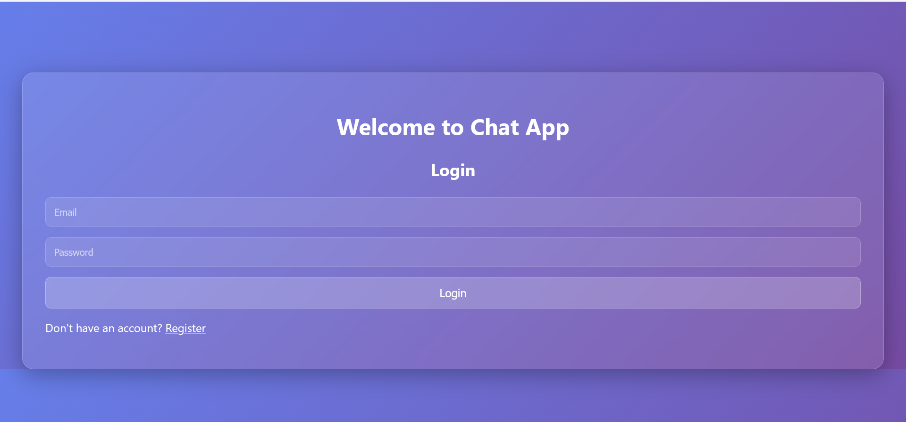

# 💬 Real-Time Chat Application

A robust, real-time chat application built with **Spring Boot** and **Vanilla JavaScript**. Features secure JWT authentication, persistent H2 file-based storage, and a responsive multi-page frontend.


---

## ✨ Features

*   **🔐 Secure Authentication**: User registration and login with **JWT (JSON Web Tokens)**.
*   **🛡️ Secure Sender Identification**: Backend validates message senders based on their auth token (spoof-proof).
*   **💾 Persistent Storage**: Messages and Users are stored in an embedded **H2 Database** (file-based).
*   **🔄 Real-Time Updates**: Frontend polls for new messages every 3 seconds.
*   **📱 Multi-Page UI**: Dedicated Login/Register page and a clean Chat interface.
*   **👤 User Context**: Displays logged-in user's name and provides Logout functionality.

---

## 📸 Screenshots

### 1. Registration & Login
User-friendly authentication forms with validation.



### 2. Chat Interface (User 1)
Clean UI with "Logged in as..." indicator and real-time polling.


### 3. Chat Interface (User 2)
Seamless conversation flow between multiple users.


---

## 🛠️ Tech Stack

### Backend (`server`)
*   **Framework**: Spring Boot 3
*   **Language**: Java 17+
*   **Database**: H2 Database (File Mode)
*   **Security**: Spring Security + JWT (JJWT)
*   **Build Tool**: Maven

### Frontend (`client`)
*   **HTML5 & CSS3**: Custom responsive styling with glassmorphism effects.
*   **JavaScript (ES6+)**: `fetch` API for REST calls, `localStorage` for token management.

---

## 📂 File Structure

### Backend Structure (`server/`)
```
server/src/main
├── java/com/example/chatbackend
│   ├── config/          # AppConfig (Bean definitions)
│   ├── controller/      # AuthController, ChatController
│   ├── model/           # User, Message Entities
│   ├── repository/      # UserRepository, MessageRepository
│   ├── security/        # JwtFilter, SecurityConfig
│   ├── service/         # AuthService, ChatService
│   └── ChatBackendApplication.java
└── resources
    ├── application.properties # DB & JWT Config
    └── data/            # H2 Database files
```

### Frontend Structure (`client/`)
```
client/
├── index.html       # Main Chat Interface (Protected)
├── login.html       # Login & Register Forms
├── script.js        # Auth logic, Polling, DOM manipulation
└── style.css        # Styling & Responsive Design
```

---

## 🚀 Getting Started

### 1. Prerequisites
*   JDK 17 or higher
*   Maven

### 2. Run the Backend
Navigate to the `server` directory and run the application:

```bash
cd server
mvn spring-boot:run
```
*The server will start at `http://localhost:8080`.*

### 3. Run the Frontend
Simply open the `client/login.html` file in your modern web browser.

1.  **Register** a new account.
2.  **Login** with your credentials.
3.  **Start Chatting!** (Open a second window/browser to test multiple users).

---

## 🔒 Configuration

You can configure JWT settings and Database path in `application.properties`:

```properties
# JWT Configuration
jwt.secret=your_very_long_secret_key_here...
jwt.expiration=86400000

# Database
spring.datasource.url=jdbc:h2:file:./src/main/resources/data/chatdb
```
